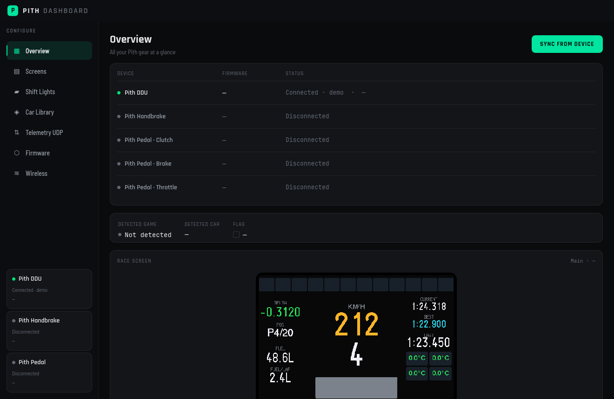
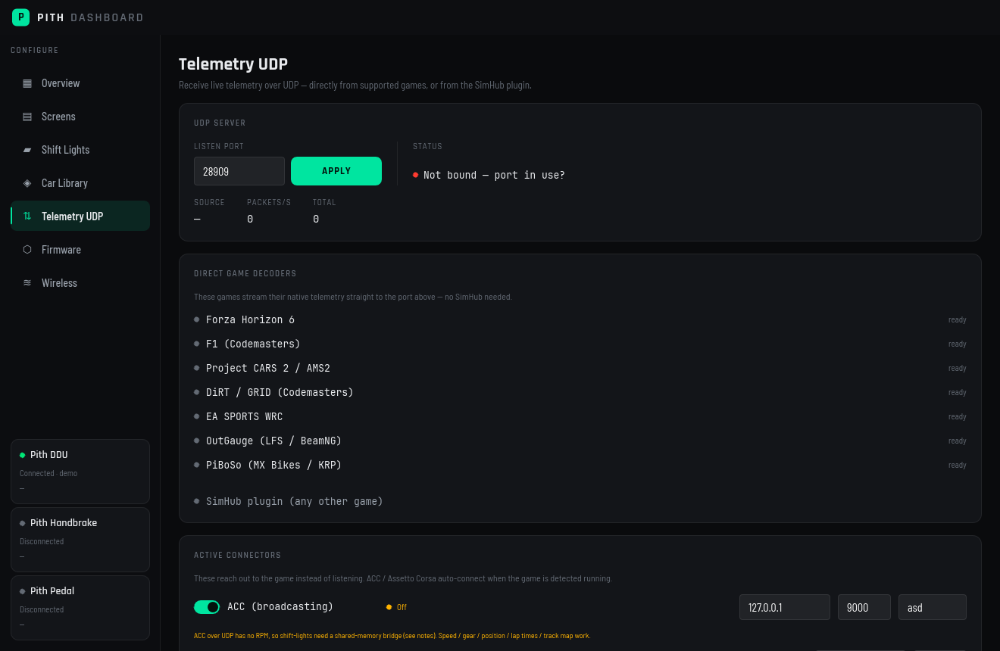
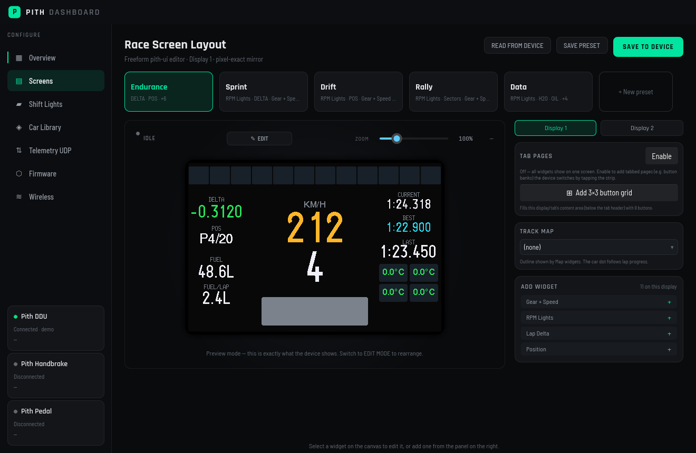

# pithddu

The **Pith DDU** sim-racing dashboard — a single all-Rust monorepo for the device
firmware, the desktop companion app, and the shared crates between them.

```
pithddu/
├─ dashboard/   Desktop companion app (Rust + Slint). Configure shift lights, touch
│               buttons, the race-screen layout and per-car data; build/flash firmware;
│               mirror live telemetry. → binary `pith-dashboard`
├─ firmware/    ESP32-S3 (XIAO S3) firmware (Rust + esp-idf, embedded-graphics + mipidsi).
│               → binary `pithddu`. Its own esp toolchain + Xtensa target.
├─ pith-core/   Shared, host-testable pure logic: telemetry parse, wire formatting,
│               field registry (codegen from firmware/main/field_registry.json). no_std.
├─ pith-sim/    Reusable telemetry sources: UDP game decoders (Forza/F1/AMS2/OutGauge),
│               connector protocols (ACC/AC/GT7), shared-memory parsers (rF2-LMU/AC/R3E)
│               + the /dev/shm reader. Bytes → a normalized pith-core Telemetry.
└─ pith-ui/     Shared runtime-interpreted UI engine: a UiDoc (postcard blob) is loaded
                and rendered at runtime via embedded-graphics — no recompile to change
                screens. Renders identically on the device panels and in the desktop
                preview. no_std.
```

## Screenshots

| Overview | Telemetry UDP | Race-screen editor |
|---|---|---|
|  |  |  |

(Regenerate with `just screenshots` — the app renders each page to `docs/screenshots/`.)

## Workspaces

The host crates (`dashboard`, `pith-core`, `pith-ui`) form one Cargo workspace at the
repo root. The **firmware is a separate sub-workspace** — it needs the `esp` Rust
toolchain and the `xtensa-esp32s3-espidf` target (`firmware/.cargo/config.toml`,
`firmware/rust-toolchain.toml`), so it is **excluded** from the root workspace and
path-depends on the shared crates (`../pith-core`).

```sh
# Host side (dashboard + shared crates) — stable toolchain
cargo build --release -p pith-dashboard
cargo test  -p pith-core
cargo run   -p pith-dashboard --example ui_preview   # live pith-ui device preview

# Firmware — esp toolchain (source ~/export-esp.sh first)
cd firmware && cargo build --release
```

The single source of truth for bindable telemetry fields is
`firmware/main/field_registry.json`; both `pith-core` and the dashboard generate their
field registries from it at build time (`build.rs`).

## Telemetry sources & coverage

Every source feeds the same positional `$`-frame (+ `@CM` car model / `@MAP` track)
that the device parses. What each game can deliver is bounded by the transport it
exposes on Linux — some games are UDP-only, some shared-memory-only, a few have both.

**Legend** — how each field is gathered per title:
`U` over the game's UDP feed · `S` from shared memory (via `pith-shim`/bridge or the
native `/dev/shm` reader) · `U·S` available from both · `C` **computed dashboard-side** (no sim sends it) · `⚠` exposed
by the title but **not yet wired** · `—` the title doesn't provide it at all · `*n` caveat.

Columns: **Forza** · **F1** (Codemasters/EA) · **AMS2** (Automobilista 2 / Project CARS 2) ·
**DiRT** (DiRT Rally / EA WRC) · **LFS** (LFS / BeamNG, OutGauge) · **GT7** (Gran Turismo 7/Sport) ·
**ACC** · **AC** (Assetto Corsa) · **EVO** (AC EVO) · **rF2** (rFactor 2 / Le Mans Ultimate) ·
**R3E** (RaceRoom).

| Field | Forza | F1 | AMS2 | DiRT | LFS | GT7 | ACC | AC | EVO | rF2 | R3E |
|---|---|---|---|---|---|---|---|---|---|---|---|
| gear / speed | U | U | U | U | U | U | U·S | U·S | S | S | S |
| rpm | U | U | U | U | U | U | S *2 | U·S | S | S | S |
| max_rpm / shift_rpm | U | U | U | U | — | U | S | S | S | S | S |
| throttle / brake | U | U | U | U | U | U | S *2 | U·S | S | S | S |
| clutch | U | U | U | U | U | — | S *2 | U·S | S | S | S |
| steer | U | U | U | U | — | — | S | U·S | S | S | ⚠ |
| cur / last lap | U | U | ⚠ *7 | U *3 | — | U *3 | U *2 | U | ⚠ | S | S |
| best lap | U | ⚠ *3 | ⚠ *7 | — *3 | — | U | U *2 | U | ⚠ | S | S |
| pb / est lap | — *6b | — | — | — | — | — | — | — | — | — | — |
| delta | C | — | C | C | — | C | U *2 | C | C | C | C |
| sectors | — | ⚠ *3 | — | — | — | — | U *2 | — | — | S | — |
| position | U | U | ⚠ *7 | U | — | — | U·S | U | ⚠ | S | S |
| laps_done | U | U | ⚠ *7 | U | — | U | U·S | U | S | S | S |
| field_size | — | ⚠ | — | — | — | — | S | — | — | S | — |
| water_c | — | U | U | — | U | U | S | S | S | S | S |
| oil_c | — | — | U | — | U | U | — | — | S | S | S |
| oil_press | — | — | U | — | U | — | — | — | — | — | S |
| boost | U | — | U | — | U | U | ⚠ | — | S | ⚠ | — |
| tc / abs level | — | U | — | — | — | — | S | — | — | S *e | S |
| brake_bias | — | U | — | — | — | — | S | — | — | ⚠ | — |
| fuel level | — *4 | U | U | — | — *4 | U | S | S | S | S | S |
| fuel capacity | — | U | U | — | — | U | ⚠ | S | S | S | S |
| fuel/lap · laps-left | C *6 | C *6 | C *6 | — *6 | — *6 | C *6 | C *6 | C *6 | C *6 | C *6 | C *6 |
| battery · ERS state | — | — | — | — | — | — | — | — | ⚠ | S *h | — |
| tyre temps | U | U | U | — | — | U | S | S | S | S | ⚠ |
| tyre pressures | — | U | — | — | — | — | S | S | — | S | — |
| tyre wear | ⚠ *8 | ⚠ | — | — | — | — | — *8 | — | — | — | — |
| brake temps | — | U | — | — | — | — | S | S | — | S | — |
| tc_active / abs_active | — | — | U *a | — | U | U *a | S | U·S | S | — | S |
| ignition | U | U | U | — | U | U | S | U·S | S | S | — |
| pit_limiter | — | U | U | — | U | — | S | S | S | S | S |
| headlights | — | — | U | — | U | U | S | S | S | S | S |
| wipers | — | — | — | — | — | — | S *5 | — *5 | ⚠ | — | — |
| flag | — | ⚠ | — | — | — | — | S | — | ⚠ | S | — |
| track map (pos/spline) | U | — | — | U | — | — | U·S | — | ⚠ | S | — |
| car model `@CM` | ⚠ *1 | — | ⚠ *7 | — | — | ⚠ *1 | S *8b | U·S | S *8c | S | — *9 |
| track name `@MAP` | — | ⚠ | ⚠ *7 | — | — | — | S *8b | U·S | S | S | ⚠ *9 |

**Notes**
- **\*1** Reported as a numeric **car ordinal/ID**, not a name → no car-library (LED-profile) match.
- **\*2** ACC's UDP **broadcasting** feed has *no* RPM / pedals / tyres / fuel — those come only from shared memory; broadcasting supplies lap times / Δ / sectors / position / spline.
- **\*3** Partial lap times: **F1** = current + last (best is in the session-history packet); **GT7** = best + last (no current); **DiRT** = current + last (no best).
- **\*4** Fuel is a **0–1 tank fraction with no capacity** over this feed → can't convert to litres.
- **\*5** **Wipers / lights / flag exist only in the shared-memory graphics page** — no UDP feed carries them. (Original-AC's graphics page predates `wiperLV`, so AC wipers = —.)
- **\*6** **Computed dashboard-side** (`telemetry::derive`): fuel-per-lap & laps-left from lap-to-lap fuel burn; **delta** from current-lap pace vs the best lap by track position. Only filled when the source doesn't already provide it (SimHub / ACC-broadcasting win), and only where fuel and lap-count (or track position + current-lap) are available. **\*6b** Forza/most don't send a personal-best/estimated lap.
- **\*7** ⚠ **Reachable, wiring in progress:** the value is in a packet/page we don't yet parse — AMS2 *participants*/*timings* packets, ACC *graphics* lap times, R3E tyres/track string.
- **\*8** Tyre wear: present but **not populated by ACC**; Forza only sends it in the Motorsport-2023 format. **\*8b** ACC car/track come from the shared-memory static page (the shim sends `@CM`/`@MAP`); the broadcasting feed's `carModelType` is a numeric enum needing a name table (planned). **\*8c** AC EVO offsets are community-reverse-engineered + early-access → fragile.
- **\*e** rF2/LMU TC/ABS *levels* aren't in Telemetry/Scoring — they're read from the **`$rFactor2SMMP_Extended$`** buffer (`rF2PhysicsOptions`), which is written at session start and persisted (not per-frame). The shim reads it directly; the bridge mirrors it to `/dev/shm`.
- **\*9** RaceRoom car is a numeric **model-id** (needs the `r3e-data.json` map); its track name is a string (wiring planned).
- **\*h** **Hybrid:** rF2/LMU hypercars & LMDh expose `mBatteryChargeFraction` (→ `battery_pct`) and `mElectricBoostMotorState` (→ `ers_state`: idle/deploy/regen) in the telemetry buffer — read directly via shm, no plugin. **LMU's "Virtual Energy" budget is NOT in the public shared-memory layout** (verified against `rF2State.h`); it's the one field that would require a custom in-game plugin.

Bottom line: **shared-memory titles (ACC / AC / EVO / rF2-LMU / RaceRoom)** can reach
near-full coverage via the in-prefix `pith-shm-bridge` tools; **UDP-only titles**
(Forza, F1, GT7, DiRT, LFS/BeamNG) are capped at whatever the game broadcasts.

### Relatives / standings

The only *multi-car* data — a list of other cars with positions and time gaps —
doesn't fit the single-car `$`-frame, so it rides its own `@REL` line. The host
(`pith_core::relatives`) builds it from a sim's all-cars buffer (rF2/LMU scoring
today; ACC broadcasting next), the shim/dashboard forward it, and the device's
**Relatives** (cars nearest you on track, signed gaps) / **Standings** (race order,
gap to leader) widget renders it. Place either from the race-editor palette.

## Releases

Independent release streams from this one repo, via tag prefixes:

- `dashboard-v*` → desktop app release (Linux tarball + `.deb`, Windows zip)
- `firmware-v*`  → firmware app image (`pithddu-<board>.bin`)

## History

This monorepo was started fresh (no history) by folding together the all-Rust
`pithddu-dashboard` and `pithddu-firmware` projects. Those repos retain their own
history and prior releases.
